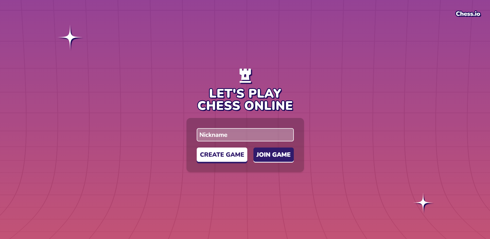
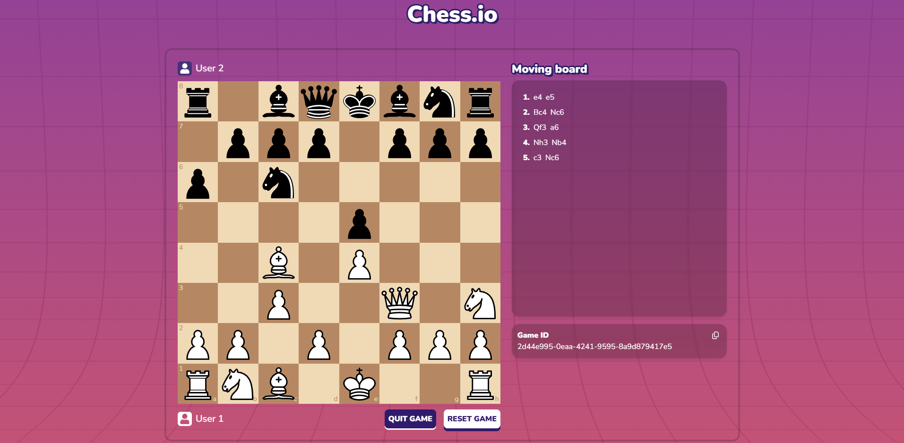

<h1 align="center" style="font-size: 50px">♟️Chess.io - real-time online chess</h1>

 

> # [Play The Game](https://chessgame-io-multiplayer.vercel.app/)  

 

## 📚 Introduction

Chess.io is a modern browser game that allows you to compete with other players in real time. The entire game runs in real time thanks to the use of Supabase Realtime, which is based on WebSockets and provides instant data synchronization between players.

 

⚙️ Tech Stack:

<ul>
  <li>React.js</li>
  <li>Supabase</li>
  <li>Javascript</li>
  <li>TailwindCSS</li>
  <li>Zustand</li>
</ul>

 

## 🎨 Mockup

 

